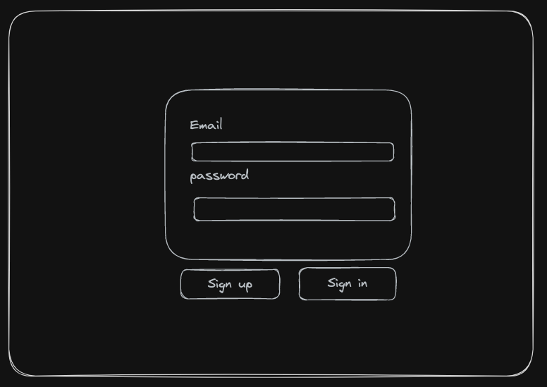
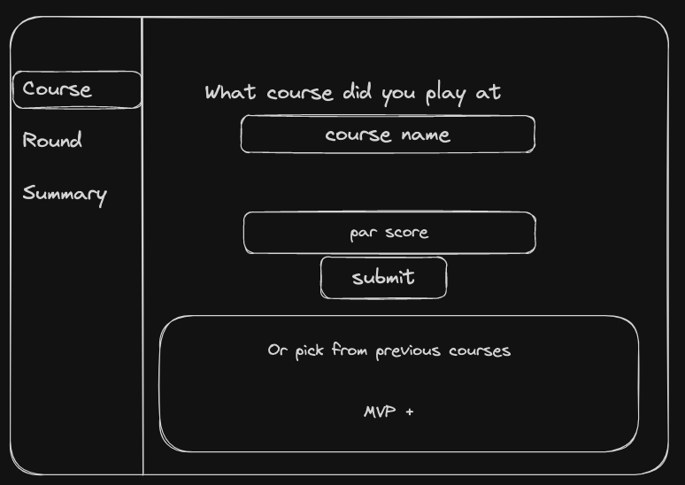
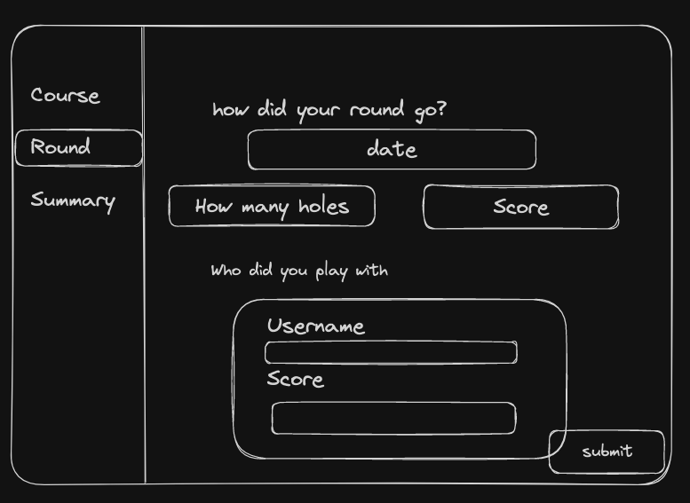
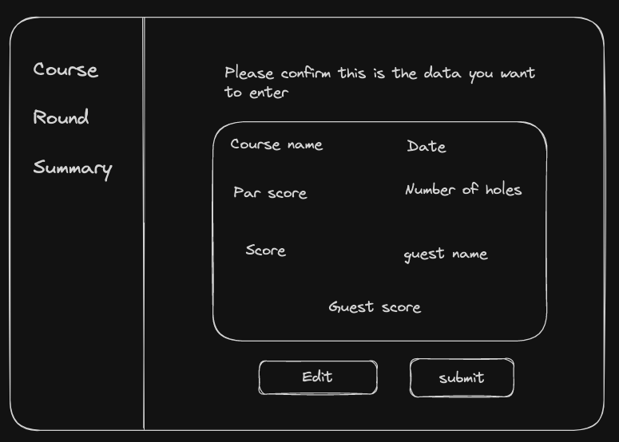
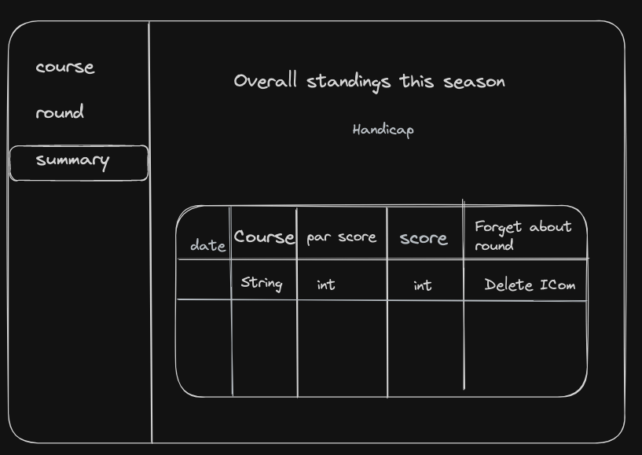
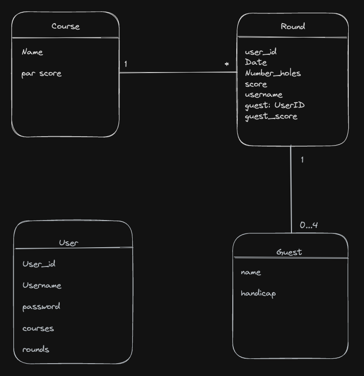

# Golfy

## Motivation
This is the final project of my Software Engineering Immersive course from General Assembly. 
The aim of the project is to combine all of the knowledge we have learnt up to this point into one full-stack project. For this project we had a lot of freedom to build whatever we wanted as long as it satisfied a few high-level requirements. 

## Requirements
- Build a full stack web application.
- In the backend, have at least two models.
- Implement user authentication.
- Have full CRUD on at least one model.
- Use one of the following tech stacks;
    - Full stack Rails
    - Rails API backend and React Frontend (not allowed to use `rails scaffold`)
    - Express API backend and react Frontend
- Fully deployed application.

## Summary 
For this project I decided to build a Rails backend and a React frontend. I chose Rails in the backend due to the amount of Gems of built-in functionality of it. For example, in order to implement full authentication using the MERN stack it took a large amount of work and debugging. With rails I used the devise and devise-jwt gems to write a large amount of the functionality for me. I chose to use a React frontend to practice my React skills. Choosing two different languages for front and back end did make deployment more challenging but my aim of this project was to learn as much as I could, so by having them different a learnt a lot more.

For the application itself I decided to build a fully responsive golf tracking website where a user can input what course they played on, what they scored, who they played with, what they scored and finally be able to see a summary of their own results.

## Wireframes

Below show the initial wireframes I made for this project. Once I created them I didn't modify them.

## Frontend

### Login/Signup

### Course

### Round

### Course/Round Summary

### Summary


## Backend

### Models


### Current State

https://master--friendly-concha-c494ca.netlify.app/SignUpPage

## Building

## Backend 

I decided to build the backend first so that once I finished it I could leave it largely untouched and focus on adding features in the frontend. The backend is the part I enjoy the most, and because I chose to keep my models fairly simple, the backend took about a day and a half in total.

The most difficult part was getting devise and devise-jwt to work. Because of the nature of Rails having huge amount of the plumbing done for you, when you get an error it can be very difficult to know how to debug it. This meant I had to restart my project 4 times until I figured out I needed to set up devise before anything else. There were a few issues getting devise to work but once I overcame those it worked as expected.

With devise up and running I then created my models and built their schemas. I did this almost entirely through the command line apart from the foregin key references in the tables which i did in the migration files themselves.

Lastly I create the routes on models.

## Fronted

For my React frontend I first built all different routes in the App.js file and set up my nav bar. From experience I found it easier to start with this rather than doing it retrospectively and having to pass lots of props around. With the routes built I created the wireframes for the sign up and login pages and tested out the integration with backend APIs. 

### Authentication
I receive a token from the backend when a user successfully signs in or signs up and I extract the token from the header inthe frontend and store it locally in the browser. I then have a set of functions to check if a token exists, and if it is valid. I can then import these functions in whichever components I need and use them.

Extracting the token from the Header
```
{
export const getPayloadFromToken = () => {
    const loadedBearerToken = getTokenFromStorage();
    
    if (!loadedBearerToken) {
      throw new Error("Token is missing or invalid");
    }
  
    const loadedToken = loadedBearerToken.replace("Bearer ", "");
    if (!loadedToken) {
      throw new Error("Token is missing or invalid");
    }
  
    const encryptedPayload = loadedToken.split(".");
    console.log("Encrypted payload: " + encryptedPayload)
    if (encryptedPayload.length < 2) {
      throw new Error("Invalid token structure");
    }
  
    const decodedPayload = Buffer.from(encryptedPayload[1], "base64").toString("utf-8");
    const parsedPayload = JSON.parse(decodedPayload);
    console.log("parased payload: ",  parsedPayload)
    return parsedPayload;
  }
}

```


I went on to build the basic functionality for all of the pages and tested their interaction with their apis.