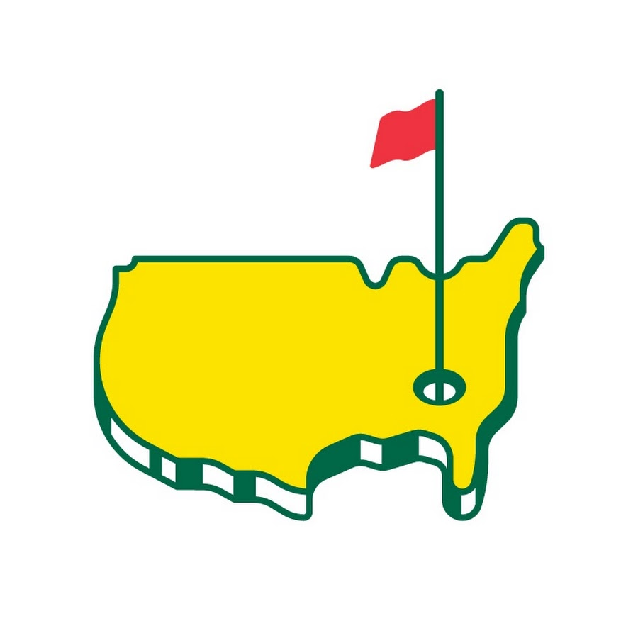

# Golfy

## Motivation
This is the final project of my Software Engineering Immersive course from General Assembly. 
The aim of the project is to combine all of the knowledge we have learnt up to this point into one full-stack project. For this project we had a lot of freedom to build whatever we wanted as long as it satisfied a few high-level requirements. 

## Requirements
- Build a full stack web application.
- In the backend, have at least two models.
- Implement user authentication.
- Have full CRUD on at least one model.
- Use one of the following tech stacks;
    - Full stack Rails
    - Rails API backend and React Frontend (not allowed to use `rails scaffold`)
    - Express API backend and react Frontend
- Fully deployed application.

## Summary 
For this project I decided to build a Rails backend and a React frontend. I chose Rails in the backend due to the amount of Gems of built-in functionality of it. For example, in order to implement full authentication using the MERN stack it took a large amount of work and debugging. With rails I used the devise and devise-jwt gems to write a large amount of the functionality for me. I chose to use a React frontend to practice my React skills. Choosing two different languages for front and back end did make deployment more challenging but my aim of this project was to learn as much as I could, so by having them different a learnt a lot more.

For the application itself I decided to build a fully responsive golf tracking website where a user can input what course they played on, what they scored, who they played with, what they scored and finally be able to see a summary of their own results.

## Wireframes

Below show the initial wireframes I made for this project. Once I created them I didn't modify them.

## Frontend

### Login/Signup

### Course

### Round

### Course/Round Summary

### Summary


## Backend

### Models


### Current State

https://master--friendly-concha-c494ca.netlify.app/SignUpPage

## Building

## Backend 

I decided to build the backend first so that once I finished it I could leave it largely untouched and focus on adding features in the frontend. The backend is the part I enjoy the most, and because I chose to keep my models fairly simple, the backend took about a day and a half in total.

The most difficult part was getting devise and devise-jwt to work. Because of the nature of Rails having huge amount of the plumbing done for you, when you get an error it can be very difficult to know how to debug it. This meant I had to restart my project 4 times until I figured out I needed to set up devise before anything else. There were a few issues getting devise to work but once I overcame those it worked as expected.

With devise up and running I then created my models and built their schemas. I did this almost entirely through the command line apart from the foregin key references in the tables which i did in the migration files themselves.

Lastly I create the routes on models.

## Fronted

For my React frontend I first built all different routes in the App.js file and set up my nav bar. From experience I found it easier to start with this rather than doing it retrospectively and having to pass lots of props around. With the routes built I created the wireframes for the sign up and login pages and tested out the integration with backend APIs. 

### Authentication
I receive a token from the backend when a user successfully signs in or signs up and I extract the token from the header inthe frontend and store it locally in the browser. I then have a set of functions to check if a token exists, and if it is valid. I can then import these functions in whichever components I need and use them.

Extracting the token from the Header
```
export const getPayloadFromToken = () => {
    const loadedBearerToken = getTokenFromStorage();
    
    if (!loadedBearerToken) {
      throw new Error("Token is missing or invalid");
    }
  
    const loadedToken = loadedBearerToken.replace("Bearer ", "");
    if (!loadedToken) {
      throw new Error("Token is missing or invalid");
    }
  
    const encryptedPayload = loadedToken.split(".");
    console.log("Encrypted payload: " + encryptedPayload)
    if (encryptedPayload.length < 2) {
      throw new Error("Invalid token structure");
    }
  
    const decodedPayload = Buffer.from(encryptedPayload[1], "base64").toString("utf-8");
    const parsedPayload = JSON.parse(decodedPayload);
    console.log("parased payload: ",  parsedPayload)
    return parsedPayload;
  }

```
Checking if the token is valud

```
  export const isUserAuthenticated = () => {
 const payload = getPayloadFromToken();
 if (!payload) return false
  const now = Math.round(Date.now() / 1000)
  return now < payload.exp
}

```

I went on to build the basic functionality for all of the pages and tested their interaction with their APIs. This process took a long time as there were many bugs and involved a lot of different console logs to figure out what was going on. This probably took me about 4 days in total and did also involve changes in the backend to return the information in the right structure.

### Styling

Once I was happy with the basic functionality I then started to add my styling. I chose to use Bootstrap for my CSS but ended up not really using apart from a few buttons as I found the layout of my changes to be fairly straightforward and the restricted nature of Bootstrap didn't really suit what I wanted from my styling.

I chose to base the theme of my  styling on a golf competition called the Masters. The background image on the login and sign up pages is one the most famous holes in the world and features in the Masters. The Masters colour sceheme is mostly green with yellow and red. Below is the logo.



In total the styling took me about 1.5 days to complete which was inline with what I was expecting as I have previously found styling fairly time consuming. I had half a day left at the end of the project to make my project responsive, which I managed to achieve.

## Deployment

My experience from the last project (group project with an Express and MongoDB backend and React frontend) led me to believe that I would need a whole day to focus on deployment. In the last project there were numerous errors each of which taking a long time to complete. Therefor I left a whole day to focus on deployment.

### Backend

The backend deployment wasn't too complicated. I chose to deploy the backend to Heroku using the Heroku CLI. The main problem I ran into was the implementation of the devise gem. I had to make a few changes to some of the lesser known Rails files and needed to make sure my secret key in Rails matched the one in Heroku. Overall I found this a lot more straightforward than deploying an Express and MongoDB backend.

### Frontend

Similar to my project 3 I chose to deploy the frontend to Netlify. In order to do this I had to make a new file that held to code to determine which envrionment the code was being run in (dev or prod) and therefore which backend URL to use. I had hardcoded my URLs so I had to edit all of them to include this change. After this there were a few issues in deployment but nothing as bad as project 3. 

Overall the whole process took about 3/4 of a day and meant that I could focus the remaining time on adding some extra features.

## Known Issues

- Currently a logged in user will be able to see other users' rounds in the summary page and not just their own.
- The summary page is responsive but because it is an html table I found it very difficult to shrink everything down by the same amount. Therefore I just made it horizontally scrollable when below a certain width.

## Features to Add

- My models have the ability for each guest to be a user in their own right. By implmenting this feature I could have list of all users and their associated handicaps in a different page.
- I would like to also make it more of a social media app for golfers, where you can make groups of friends and compare scores within a group.
- I want the summary page to be more responsive than it is.

## Lessons Learnt

- Next time I do a project that involves styling I will Tailwind for my CSS. Tailwind makes it very easy to have responsive apps from the start and my app took about half a day to make responsive as I have a number of media queries.
- The further along a project you get the harder it becomes to add features that don't introduce bugs. Therefore next time I will plan in my additional features before I start. In this way if I don't have time to finish them it won't brake anything, but if I do have time I would have to make any changes on the fly to my backend models that might have unintended consequences on seeemingly unrelated areas.